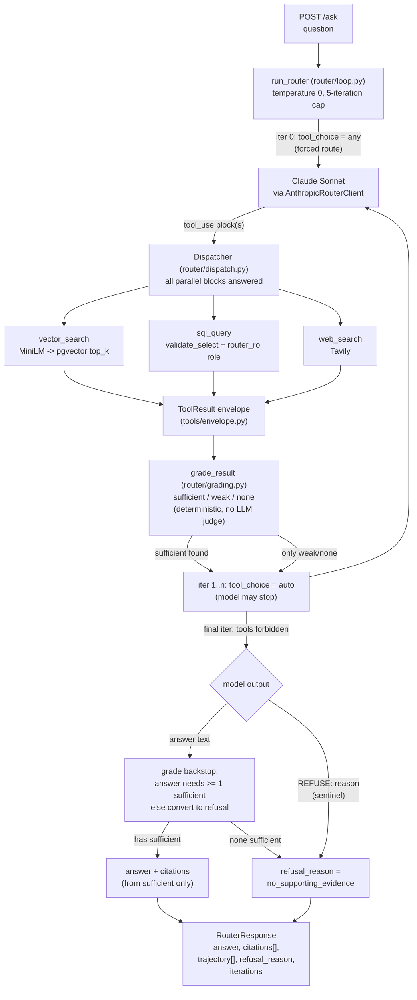
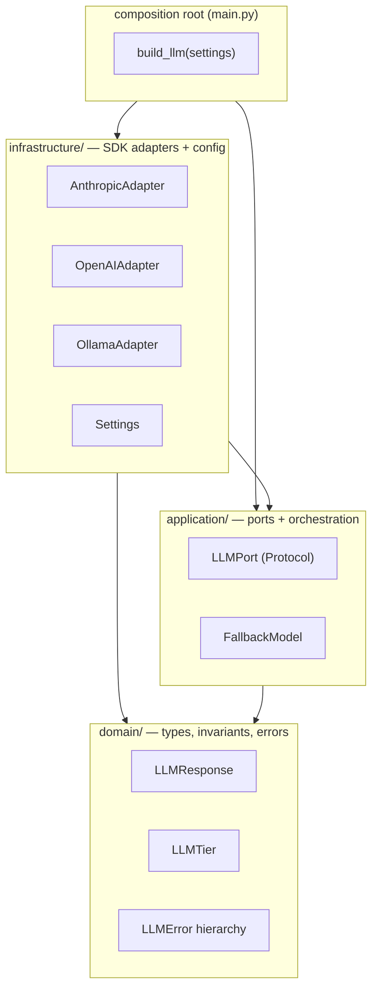
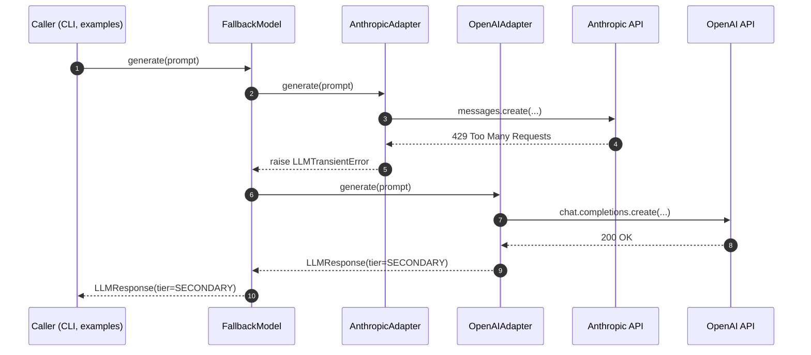

# Architecture

`agentic-rag-router` is a per-question retrieval router. For each question it
routes to one of three substrates (vector search, SQL, or web), grades the
evidence deterministically, answers with citations and a full tool trajectory,
and refuses with zero citations when nothing supports an answer. This file is the
map: it explains the shape of the system. The router's request flow comes first;
the inherited LLM-adapter substrate it is built on follows at the end.

The router is built on a hexagonal / DDD-lite layout: three layers, one strict
dependency rule, one composition root. The same layout carries both the router
and the adapter library underneath it.

## Request flow: `POST /ask`

This is the product. A question enters the FastAPI surface, the router drives
Claude Sonnet through a hand-written agentic loop, each chosen tool runs and is
graded, and the loop returns a single envelope describing what happened.

Two design choices carry the whole product:

The loop **forces a route on iteration 0 and relaxes after.** Iteration 0 sets
`tool_choice = any`, so the model must commit to a substrate rather than answer
from parametric memory. From iteration 1 the choice relaxes to `auto`, so the
model can stop once it has evidence. The final iteration forbids tools entirely,
so the model must answer or refuse from what it already gathered instead of
searching forever. A 5-iteration cap bounds the worst case.

Refusal has **two independent doors feeding one exit.** The model sentinel: when
the evidence does not support a grounded answer, the model replies with exactly
`REFUSE: <reason>`, which the loop detects and surfaces as
`refusal_reason: "no_supporting_evidence"`. The deterministic grade backstop: any
answer that does not rest on at least one `sufficient` tool result is converted
to a refusal regardless of what the model said. Citations flow only from
`sufficient` evidence, so every refusal carries zero citations by construction.

## The three substrates (`tools/`)

Each tool returns the same typed `ToolResult` envelope
(`ok, tool, data, error_code, error_message, latency_ms`), so the loop and the
grader treat all three uniformly.

| Tool | Substrate | Notes |
| --- | --- | --- |
| `vector_search` | ~11k arXiv cs.{CL,LG,AI,IR} abstracts in pgvector | Embeds the query with all-MiniLM-L6-v2 (384-dim), fetches top-k by cosine similarity. |
| `sql_query` | 3M-row NYC yellow-taxi table (Postgres) | The model authors a single read-only `SELECT`; `validate_select` rejects anything else, and the connection uses the SELECT-only `router_ro` role as a backstop. |
| `web_search` | Live Tavily | The only live-data path; covers facts after the corpus cutoff. |

The tool **descriptions are the routing policy.** The model routes purely on the
`description` field of each tool definition in `router/schema.py`, so those
strings are tuned against the frozen golden set, not written as documentation.
Editing a description changes routing behaviour; editing an adapter does not.

## Evidence grading (`router/grading.py`)

Grading is deterministic code, never an LLM. An LLM grader would double latency
and cost, expand the cassette surface, and itself need an eval. Each tool result
is graded into one of three buckets from its envelope alone:

- `sufficient`: evidence good enough to ground an answer and to cite.
- `weak`: the tool returned something, but not strong enough to answer on. An
  answer resting only on `weak`/`none` evidence is converted to a refusal by the
  loop's backstop.
- `none`: the tool failed or returned nothing usable.

Per-tool rules: `vector_search` splits `sufficient`/`weak` on the top hit's
cosine similarity against an empirically pinned floor (0.40); `sql_query` is
`sufficient` whenever it executed (an empty aggregate still answers the
question); `web_search` is `sufficient` when the top result carries a real source
URL. The vector floor is deliberately narrow: the adversarial near-misses in the
eval set are topically on-corpus and score as high as genuine questions, so no
similarity threshold can separate them. That separation is the sentinel's job;
the threshold only protects genuine answers from over-refusal and catches clearly
off-topic mis-routes.

## The dependency rule

The router and its substrate share one layout. Read the arrows as "knows about".
`domain/` knows about nothing; `application/` knows about `domain/`;
`infrastructure/` knows about both; the composition root knows about all three
because something has to wire the graph.

The rule is enforced two ways: illegal cross-layer imports are caught by
pre-commit's ruff pass and by code review, and the test layout mirrors the
layers (`tests/unit/domain/` never imports from `infrastructure`).

The router product lives one level out from this core. `router/` and `tools/`
depend on the domain types and on their own ports (`AnthropicClientPort`,
`DispatcherPort`, `EmbedderPort`, `VectorRepository`), and `api/` composes them
behind `POST /ask`.

## Inherited substrate: the LLM-adapter library

The repo was scaffolded from a personal template, and that template shipped a
working three-tier LLM-adapter library: an `LLMPort` protocol, three vendor
adapters (Anthropic / OpenAI / Ollama), and a `FallbackModel` that cascades
primary to secondary to tertiary on retryable errors.

**The router does not use this stack.** It drives Claude directly through its own
`AnthropicRouterClient` (`router/client.py`), which wraps the `anthropic` SDK and
implements the single `AnthropicClientPort` method the loop needs. The adapter
library is exercised by the example scripts in `examples/` and by the
`python -m agentic_rag_router.main` CLI, not by `POST /ask`. It is kept as
honest, tested plumbing rather than deleted, and it carries its own value: a
parametrized contract suite that proves every adapter honours one behavioural
contract.

`FallbackModel` is itself an `LLMPort`, so a composed stack is indistinguishable
from a single adapter to anything downstream. A `LLMPermanentError` or
`LLMContentError` from any tier aborts the walk, because those states do not
improve by retrying elsewhere.

## Testing strategy

Concentric suites, each with a different budget and failure signal:

- **Unit tests** (`tests/unit/`). Every source module has a dedicated file.
  Adapters and the router client monkey-patch the vendor SDK so no network is
  touched. 100% line and branch coverage on `src/` is a hard target.
- **Contract tests** (`tests/contract/`, 32 parametrized cases). One test body
  across four `LLMPort` implementations (three real adapters plus an in-memory
  fake) proves every adapter honours the same contract. A drifting adapter shows
  up as a vendor-tagged failure rather than a runtime shape mismatch. This is the
  architectural drift detector for the substrate library.
- **Eval guards** (`tests/test_eval_gates.py`, `tests/test_eval_set_frozen.py`).
  The committed eval report is pinned to the frozen golden set by hash, so a
  router change without a fresh eval run turns CI red. The golden set and rubric
  are byte-frozen.
- **Integration and live tests** (`tests/integration/`, `tests/live/`). Opt-in.
  Integration needs the docker-compose data layer; live needs API keys. Both are
  excluded from the offline gate.

The offline gate (`make check`) runs ruff, mypy, bandit, and the unit + contract
+ eval-guard suites: 387 tests at 100% line and branch coverage on `src/`.

## Extension points

Adding an LLM tier (for example Google Gemini): create
`infrastructure/gemini_adapter.py` implementing `LLMPort`, add a unit test that
monkey-patches its SDK, register it with `tests/contract/conftest.py` so the
contract suite picks it up, and wire it into `main.build_llm`.

Adding a routing substrate (a fourth tool): add a tool definition to
`router/schema.py` (the description is the routing contract), implement the
adapter in `tools/` returning a `ToolResult`, extend the grader in
`router/grading.py`, and add golden questions for the new class before tuning.

Either expansion stays inside the dependency rule and does not touch the parts of
the codebase that already work.
